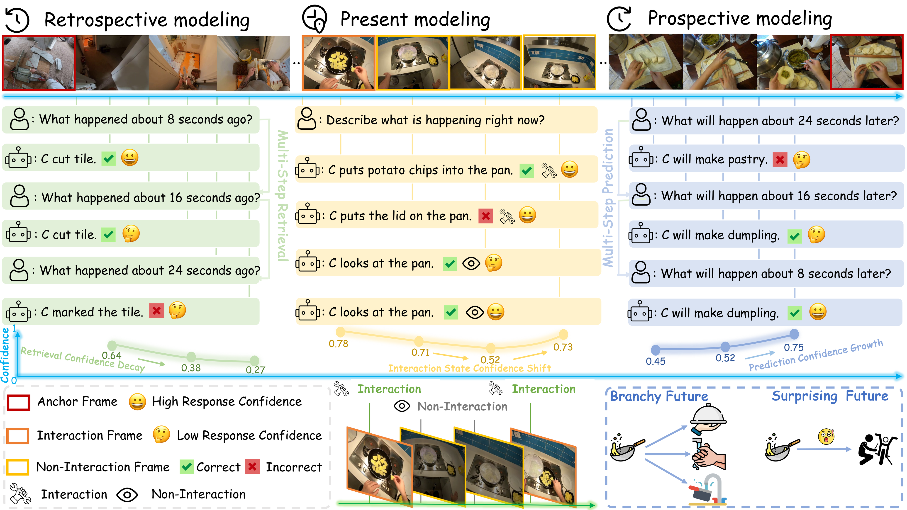
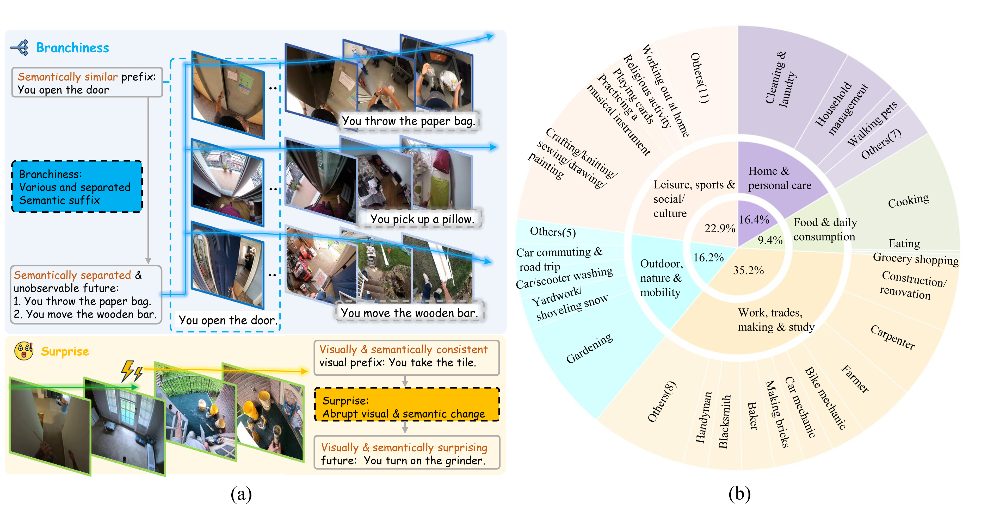
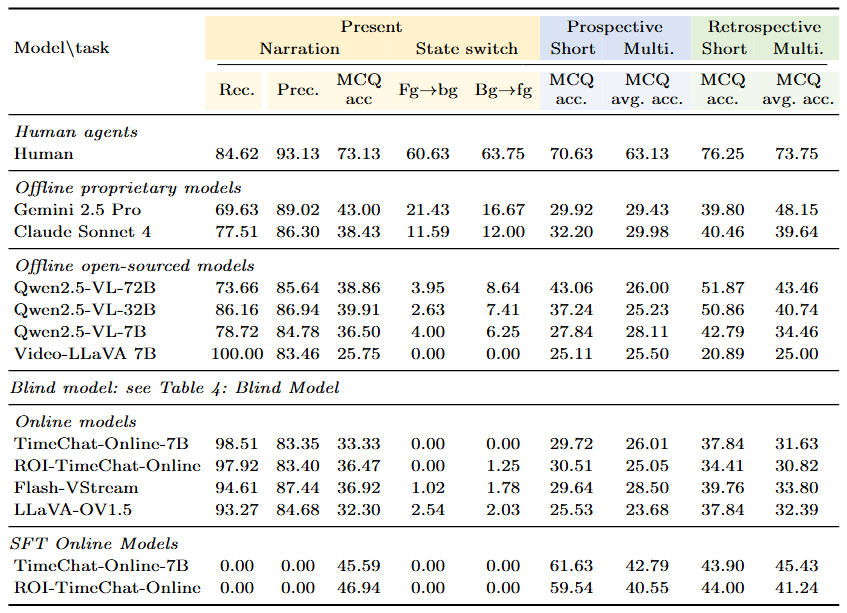

<h1 align="center">EgoSAT: A Comprehensive Benchmark of Egocentric Streaming Interaction Understanding</h1>

<p align="center">
  A benchmark for evaluating retrospective, present, and prospective reasoning in egocentric streaming video understanding.
</p>

<p align="center">
  
</p>

<p align="center">
  <a href="https://leiyj23.github.io/EgoSAT/">Project Page</a> |
  <a href="https://arxiv.org/abs/2606.24422">arXiv Paper</a> |
  <span>Dataset coming soon</span>
</p>

<p align="center">
  <strong>EgoSAT is accepted to ECCV 2026.</strong>
</p>

## Introduction

Recent advances in wearable cameras, edge computing, and vision-language models are making first-person AI assistants increasingly practical. In real deployments, such assistants must continuously understand streaming video, respond to the user's current environment, remember relevant past events, and anticipate plausible future interactions.

Existing benchmarks often evaluate video question answering, online narration, and activity anticipation as separate problems. EgoSAT instead uses a unified streaming formulation for egocentric interaction understanding. At each query time, a model can only use video that has already been observed, and it is evaluated on retrospective, present, and prospective reasoning in the same benchmark. EgoSAT also studies whether models can recognize answerability under partial observability and calibrate their confidence when an answer may be uncertain.

### Three distinct reasoning modes

**Present modeling.** The model answers questions about the current observation and identifies visible human-object interaction happening right now.

**Prospective modeling.** The model predicts future interactions from the observed video prefix and estimates whether the future is predictable from available evidence.

**Retrospective modeling.** The model answers questions about past events by locating the relevant moment in the observed streaming history.

## Dataset

### Dataset Statistics

EgoSAT is built from Ego4D and contains:

- 1,997 egocentric videos
- 165 hours of egocentric footage
- 296.8 seconds average video duration
- 56 diverse real-world scenarios with human-curated annotations
- approximately 4,800 high-quality question-answer pairs

<p align="center">
  
</p>

### Answerability-aware Construction

**Branchiness.** Branchiness captures uncertainty from multiple plausible and semantically diverse future continuations after the same observed interaction prefix.

**Surprise.** Surprise captures uncertainty from abrupt visual and semantic shifts between the recent observed context and the imminent future event.

## Evaluation Pipeline

### Requirements

EgoSAT separates the benchmark dependencies from model-specific dependencies.

For running the EgoSAT runner, helper, lightweight API-style adapters, and official scorer:

```bash
pip install -r requirements.txt
```

For SFT or training-related workflows:

```bash
pip install -r requirements-full.txt
```

`requirements.txt` is sufficient for core evaluation utilities and lightweight adapters, but local model adapters may require additional model-specific packages. `requirements-full.txt` includes the core requirements and common LoRA/SFT dependencies; model-specific backbones, external repositories, and CUDA-specific PyTorch wheels should be installed according to their own instructions.

FFmpeg is required for video clipping/processing and should be installed as a system dependency:

```bash
# Ubuntu
sudo apt-get install ffmpeg

# macOS
brew install ffmpeg
```

For local VLM inference or SFT, install PyTorch according to your CUDA version. The core requirements do not include every dependency required by every model adapter:

- Qwen adapters may need `torch`, `transformers`, `qwen-vl-utils`, and video decoding utilities.
- TimeChat / ROI-TimeChat adapters may require the external TimeChat-Online codebase and its own dependencies.
- Custom adapters should document their own dependencies.

See [docs/model_guide.md](docs/model_guide.md) for adapter integration details.

Raw Ego4D videos are not included. Users must obtain Ego4D access separately and set `EGO4D_VIDEO_ROOT` to their local video root.

### Data Preparation

Download the EgoSAT annotations, MCQ candidates, effective querysets, and SFT manifests from the Hugging Face dataset release once the dataset link is available. ROI cache files, when needed, should be obtained from the separate ROI cache release.

Raw Ego4D videos are not redistributed with EgoSAT. Users must obtain Ego4D access and the corresponding license separately, then organize the videos under a local private root.

Recommended local directory layout:

```text
EgoSAT-data/
  egosat/
    gt/
    mcq_shuffled/
    effective_querysets/
    metadata/
  sft/

EgoSAT-ROI-Cache/
  roi_cache/
  metadata/

Ego4D/
  videos/
```

Example environment variables:

```bash
export EGOSAT_DATA_ROOT=/path/to/EgoSAT-data/egosat
export EGOSAT_ROI_CACHE_ROOT=/path/to/EgoSAT-ROI-Cache
export EGO4D_VIDEO_ROOT=/path/to/Ego4D/videos
```

### Model Preparation

To evaluate a new model on EgoSAT, implement a model adapter that connects the model to the EgoSAT runner and helper pipeline. See the [Model Adapter Guide](docs/model_guide.md).

An adapter should load video prefixes available before each query time, receive task-specific prompts and querysets, return structured answers, and optionally expose MCQ confidence scores for confidence diagnostics.

### Evaluation

Run inference with the provided scripts. A minimal MCQ example is:

```bash
bash scripts/run_mcq_inference.sh qwen2_5_vl_7b \
  --task sh_rtrv \
  --gt-root "$EGOSAT_DATA_ROOT/gt/sh_rtrv" \
  --mcq-root "$EGOSAT_DATA_ROOT/mcq_shuffled/sh_rtrv" \
  --ego4d-root "$EGO4D_VIDEO_ROOT" \
  --runs-root outputs/runs \
  --output outputs/normalized/sh_rtrv_mcq.jsonl
```

Then run the main-table scorer:

```bash
python evaluation/evaluate_main_table.py \
  --pred-root outputs/runs/qwen2_5_vl_7b \
  --model qwen2_5_vl_7b \
  --gt-root "$EGOSAT_DATA_ROOT/gt" \
  --mcq-root "$EGOSAT_DATA_ROOT/mcq_shuffled" \
  --effective-queryset-root "$EGOSAT_DATA_ROOT/effective_querysets" \
  --out-dir outputs/evaluation/qwen2_5_vl_7b \
  --ss-pos ss_pos_1=sspos_t_1_0 \
  --ss-pos ss_pos_2=sspos_t_2_0 \
  --ss-pos ss_pos_3=sspos_t_4_0
```

The official scorer uses raw per-sample prediction JSON files produced by the runner. Normalized JSONL files are useful for inspection and downstream convenience, but they are not the official scorer source. Effective querysets define the official evaluation subset. For `now_state_switch`, the official positions include `sspos_t_1_0`, `sspos_t_2_0`, and `sspos_t_4_0`.

See [docs/inference.md](docs/inference.md) and [evaluation/README.md](evaluation/README.md) for model-specific inference details, prediction layout, confidence inputs, and metric definitions. SFT manifests are documented in [training/README.md](training/README.md).

## Experimental Results

### Performance of closed-source proprietary models, offline open-weight VLMs, and streaming VLMs on EgoSAT

<p align="center">
  
</p>

## Citation

If you find EgoSAT useful for your research, please cite:

```bibtex
@inproceedings{lei2026egosat,
  title={EgoSAT: A Comprehensive Benchmark of Egocentric Streaming Interaction Understanding},
  author={Lei, Yijia and Li, Jinzhao and Zhang, Yichi and Hua, Jiacheng and Li, Yin and Liu, Miao},
  booktitle={European Conference on Computer Vision},
  year={2026}
}
```

## License

Code in this repository is released under the MIT License. Raw Ego4D videos are not redistributed and are governed by the Ego4D license. Dataset license and usage terms should be checked in the Hugging Face Dataset Card once the dataset release is public.
